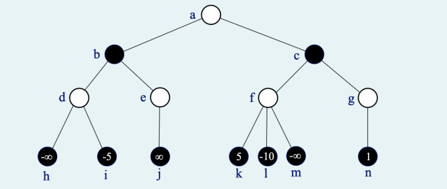

## úloha 1

(10 bodů) Na vstupu je dána posloupnost nul a jedniček. Navrhněte efektivní algoritmus, který v posloupnosti najde souvislý úsek, který obsahuje více jedniček než nul a rozdíl počtu jedniček a počtu nul je v něm maximální. Výsledkem algoritmu bude údaj, o kolik je v nalezeném úseku více jedniček než nul.

Navrhněte postup, jak správně vyřešit úlohu s co nejlepší časovou složitostí vzhledem k délce posloupnosti n. Budete-li používat nějakou pomocnou datovou strukturu, nezapomeňte popsat složitost operací nad ní prováděných.

(a) Popište algoritmus (včetně datových struktur, které případně budete používat). Programový kód není povinný, slovní vysvětlení zvoleného postupu řešení naopak povinné je.

(b) Zdůvodněte správnost algoritmu.

(c) Odvoďte asymptotickou časovou a prostorovou složitost (v nejhorším případě).

Příklad:

vstup: 1 1 0 1 0 0 1 1 0 1 0 1 1 0 0 1 0 0 0

výstup: 3

## úloha 2

je zadán binární strom o n vrcholech, v nichž jsou uložena navzájem různá celá čísla. Navrhněte efektivní algoritmus, který ve stromu najde cestu z vrcholu se zadanou hodnotou x do vrcholu se zadanou hodnotou y. Nalezenou cestu funkce vrátí jako seznam čísel vrcholů tvořících tuto cestu. Pokud hodnota x či y ve stromu není, funkce vrátí prázdný seznam.

(a) Svoje řešení zapište jako funkci v Pythonu, využijte definici třídy pro vrchol binárního stromu uvedenou níže a váš kód opatřete komentáři,

(b) zdůvodněte správnost,

(c) odvoďte časovou složitost.

```
class VrcholBinStromu:
    """třída pro reprezentaci vrcholu binárního stromu""" 
    def __init__(self, x = None, levy = None, pravy = None)
        self.info = x # data 
        self.levy = levy # levé dítě 
        self.pravy = pravy # pravé dítě
def cesta(koren: VrcholBinStromu, x : int, y : int) -> list<int> :
    """
    koren : koren zadaného binárního stormu
    x,y   : hodnoty koncovych vrcholu hledane cesty
    vrati : seznam cisel vrcholu na ceste z x do y
    """
```

## úloha 3

Odpovězte na otázky, své odpovědi vždy zdůvodněte.

(a) Dokažte nebo vyvraťe každé z následujících tvrzení:

(a1) pro libovolné tři funkce f,g,h: N -> R+ platí:
jestliže f = O(h) a g = Omega(h), potom f = O(g)

(a2) pro libovolné tři funkce f,g,h: N -> R+ platí:
jestliže f = O(h) a g = Omega(h), potom f + g = Omega(h)

(a3) pro libovolné tři funkce f,g,h: N -> R+ platí:
jestliže f = O(h) a g = Omega(h), potom f * g = Omega(h)

Svoji odpověď zdůvodněte, tj. tvrzení dokažte (pokud platí) či sestrojte protipříklad (pokud neplatí).

(b) Strom hry dvou hráčů byl vygenerován do hloubky 3, všechny vrcholy v této hloubce byly ohodnoceny statickou ohodnocovací funkcí a hodnoty zbývajících vrcholů byly spočítány minimaxovým algoritmem. V bílých vrcholech je na tahu hráč maximum, v černých minimum. Výpočet bychom rádi zrychlili metodou alfa-beta prořezávání.



(b1) Jaká bude minimaxová hodnota kořenu stormu?

(b2) V jakém pořadí j+e třeba procházet strom, abychom se alfa-beta prořezáváním vyhnuli vyhodnocení co nejvíce vrcholů? Pro popis pořadí můžete využít označení vrcholů (a, b, c, ... ). Kolik vrcholů v takovém případě nemusíme navštívit?

(b3) Existuje nějaký průchod stromem, kdy alfa-beta prořezáváním nic neušetříme (tj. pro určení minimaxové hodnotykořene musíme navštívit a ohhodnotit všech 14 vrcholů)? Pokud ano, popište ho, pokud ne, vysvětelte proč.
